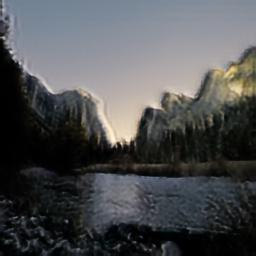
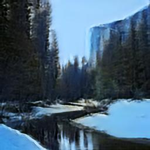
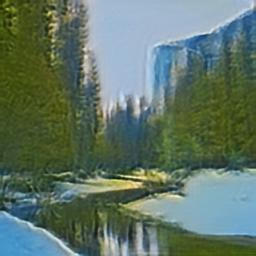
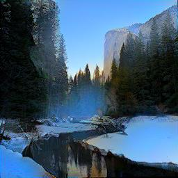

# Homework 1 (Color-Transfer and Texture-Transfer)

## Training MUNIT
Under the limit of time and space constraint, we train MUNIT on `summer2winter_yosemite`  dataset only with batch size `1` and `200000` iterations. All the images are trained and tested under resolution of `256x256`.

The training loss is depicted as below figure:
| Discriminator Loss | Generator Loss |
| :--: | :--: |
|  |  |

## Inference one image in multiple styl
Some result of the trained model are shown in below:

**Summer to Winter**

| Input (summer) | Output (winter) |
| :------------: | :-------------: |
|  |  |
|  |  |
|  |  |
|  |  |

**Winter to Summer**

| Input (winter) | Output (summer) |
| :------------: | :-------------: |
|  |  |
|  |  |
|  |  |
|  |  |

**Result of each content style combination**

| Summer Content   Winter Style |  |  |  |
| :------------: | :-------------: | :------------: | :-------------: |
|  |  |  |  |
|  |  |  |  |
|  |  |  |  |

| Winter Content   Summer Style |  |  |  |
| :------------: | :-------------: | :------------: | :-------------: |
|  |  |  |  |
|  |  |  |  |
|  |  |  |  |

The result shown above is already convince us that the model is capable of transfering style and content between given two images. However, we do observe some failure result like:

|  |  |  |

Some possible reasons:
- Our training time is not enough
- The random sampled style image is not suitable for the content

## Compare with other method
We show some result of neural style transfer with ImageNet pretrained vgg19 directly applied on the dataset we use.

| Summer Content   Winter Style |  |  |  |
| :------------: | :-------------: | :------------: | :-------------: |
|  |  |  |  |
|  |  |  |  |
|  |  |  |  |

| Winter Content   Summer Style |  |  |  |
| :------------: | :-------------: | :------------: | :-------------: |
|  |  |  |  |
|  |  |  |  |
|  |  |  |  |

As the model is only pre-trained on ImageNet, the result is not as well as expected with artist painting like result. A clever choice for such pre-trianed setting is to use artist style to another arthis style transfer while realistic scene is not a good choice for such setting.
